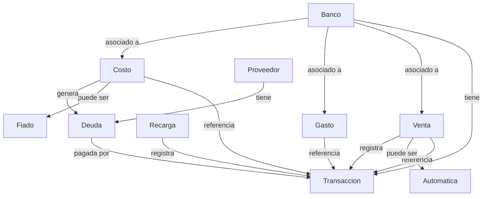

# Módulo de Finanzas: Bancos, Transacciones y Deudas

## Objetivo
Centralizar y visualizar el control financiero de la empresa: bancos, montos en tiempo real, transacciones, acreedores y deudas.

---

## Requisitos Funcionales

1. **Vista de Bancos**
	- El módulo debe aparecer en el sidebar, en la sección de Finanzas, como primer elemento.
	- Listar bancos con su información (foto, número de cuenta, tipo, descripción, monto actual).
	- Permitir edición de datos del banco (solo empleados con permiso).
	- Agregar campo `monto` a la tabla/modelo Banco.

2. **Transacciones Bancarias**
	- Registrar cada movimiento que afecte el monto del banco (ingreso/egreso).
	- Crear tabla y modelo `Transaccion` con los siguientes campos:
	  - banco_id (FK)
	  - tipo (ingreso/egreso)
	  - monto_anterior
	  - monto_transaccion
	  - monto_actualizado
	  - referencia (venta, gasto, costo, recarga, pago de deuda, etc.)
	  - fecha

3. **Integración con Ventas, Costos, Gastos y Recargas**
	- Agregar campo banco_id (FK) en ventas, costos y gastos para registrar el banco involucrado.
	- En ventas automáticas (cliente compra con saldo), no registrar transacción bancaria (la transacción se registra en la recarga).
	- En recargas, al aprobar, registrar la transacción bancaria.

4. **Trazabilidad y Control de Transacciones** ⚠️ **NUEVA FUNCIONALIDAD CRÍTICA**
	- **Objetivo**: Mantener integridad referencial y trazabilidad completa entre operaciones financieras y transacciones bancarias.
	- **Implementación**:
		- Agregar campo `transaccion_id` (FK nullable) en tablas: `ventas`, `costos`, `gastos`.
		- Al crear venta/costo/gasto:
			1. Registrar transacción bancaria (como se hace actualmente)
			2. Guardar el ID de la transacción creada en el registro de venta/costo/gasto
		- **Al actualizar venta/costo/gasto**:
			1. Si cambia el banco o el monto:
				- Revertir transacción anterior (actualizar monto del banco anterior)
				- Eliminar o marcar como anulada la transacción anterior
				- Crear nueva transacción con el banco correcto
				- Actualizar `transaccion_id` en el registro
			2. Si no cambia banco ni monto: no hacer nada
		- **Al eliminar venta/costo/gasto**:
			1. Revertir la transacción (devolver monto al banco)
			2. Eliminar o marcar como anulada la transacción asociada
	- **Beneficios**:
		- ✅ Corrección de errores de captura (ej: banco incorrecto)
		- ✅ Montos bancarios siempre reflejan la realidad
		- ✅ Auditoría completa: cada operación apunta a su transacción
		- ✅ Historial de cambios rastreable
	- **Ejemplo de Caso de Uso**:
		```
		1. Empleado registra venta con Banco Guayaquil (ERROR)
		   → Se crea Transaccion #1, ingreso $100 a Guayaquil
		   → venta.transaccion_id = 1
		
		2. Empleado corrige: cambia a Banco Pichincha
		   → Se revierte Transaccion #1 (egreso $100 de Guayaquil)
		   → Se marca Transaccion #1 como anulada
		   → Se crea Transaccion #2, ingreso $100 a Pichincha
		   → venta.transaccion_id = 2
		
		3. Resultado: Montos correctos, trazabilidad completa
		```

5. **Gestión de Deudas a Proveedores**
	 - Registrar costos fiados (checkbox en formulario de costo).
	 - Crear módulo y tabla/modelo `Deuda` con atributos:
		 - costo_id (FK) *(desde aquí se accede a cuenta, valor y proveedor por relaciones Eloquent)*
		 - monto
		 - estado (pendiente/pagada)
		 - fecha
	 - Permitir abonos y pagos parciales/completos, registrando la transacción bancaria al pagar.

5. **Dashboard Financiero**
	- Visualizar bancos y sus montos en tiempo real.
	- Listar transacciones recientes.
	- Mostrar acreedores y deudas pendientes.
	- Gráficos de movimientos y saldos.

---

## Propuestas Técnicas

- **Tablas y Modelos Nuevos:**
  - `Transaccion` (movimientos bancarios)
  - `Deuda` (deudas a proveedores)

-- **Modificaciones en Tablas Existentes:**
	- Agregar campo `monto` en `bancos` (monto actual, calculado por transacciones)
	- Agregar campo `monto_inicial` en `bancos` (solo editable por migración/tinker/seed, nunca por la app)
	- Agregar campo `banco_id` en `ventas`, `costos`, `gastos`
	- Agregar campo `transaccion_id` (FK nullable) en `ventas`, `costos`, `gastos` para trazabilidad
---

## Consideraciones de Seguridad y Transparencia

- El campo `monto_inicial` en bancos se establece solo una vez (por migración, tinker o seed) y no se puede editar desde la aplicación.
- En el modelo Banco, proteger el campo para que no sea editable por formularios ni controladores.
- El monto actual del banco (`monto`) se calcula y actualiza únicamente por las transacciones registradas.

- **Permisos y Seguridad:**
  - Seeder de permisos para acceso y edición de bancos.
  - Validar acceso en controladores y vistas.

- **Vistas y UI:**
  - Dashboard financiero (bancos, transacciones, deudas, acreedores)
  - Formularios para registrar movimientos, abonos, pagos, edición de bancos.

---

## Gráfico Conceptual



---

## Pasos para Desarrollo

1. **Diseño de Base de Datos** ✅ COMPLETADO
	- ✅ Crear migraciones para nuevos campos y tablas (`monto` en bancos, `Transaccion`, `Deuda`, `banco_id` en ventas/costos/gastos).

2. **Modelos y Relaciones** ✅ COMPLETADO
	- ✅ Definir modelos y relaciones Eloquent.
	- ✅ Modelos: Transaccion, Deuda, Banco (actualizado)
	- ✅ Relaciones: banco_id en Venta, Costo, Gasto

3. **Seeder de Permisos** 🔄 PENDIENTE
	- Crear y ejecutar seeder para permisos de acceso/edición.

4. **Lógica de Negocio** 🔄 EN PROGRESO
	- ✅ BancoService para registrar transacciones
	- ✅ Actualizar montos de bancos según transacciones
	- ✅ Registrar transacciones en ventas, recargas, costos, gastos
	- ✅ Manejar ventas automáticas (excluir idemp=10)
	- ⏳ Implementar trazabilidad: agregar transaccion_id en ventas/costos/gastos
	- ⏳ Implementar reversión de transacciones en updates/deletes
	- ⏳ Manejar costos fiados y pagos de deudas

5. **Vistas y UI** 🔄 EN PROGRESO
	- ✅ Dashboard financiero con 3 pestañas (bancos, transacciones, deudas)
	- ✅ Modal para registrar transacciones
	- ✅ Selectores de banco en ventas, costos, gastos con searchable-select
	- ⏳ Formularios para abonos, pagos, edición de bancos

6. **Trazabilidad y Control de Transacciones** ⏳ PENDIENTE - ALTA PRIORIDAD
	- Crear migración para agregar `transaccion_id` en ventas, costos, gastos
	- Modificar BancoService para retornar el ID de la transacción creada
	- Actualizar controladores (Venta, Costo, Gasto) para:
		- Guardar transaccion_id al crear
		- Revertir y recrear transacción al actualizar banco/monto
		- Anular transacción al eliminar registro
	- Implementar método en BancoService para anular/revertir transacciones
	- Agregar campo `anulada` (boolean) en tabla transacciones
	- Testing exhaustivo de flujos de actualización y eliminación

7. **Pruebas y Validación** ⏳ PENDIENTE
	- Testear flujos de transacciones, pagos, abonos, visualización de montos y deudas.

---

## Conclusión
Este módulo permitirá un control financiero integral, visualizando en tiempo real los montos de bancos, movimientos, deudas y acreedores, facilitando la toma de decisiones y la gestión contable.
