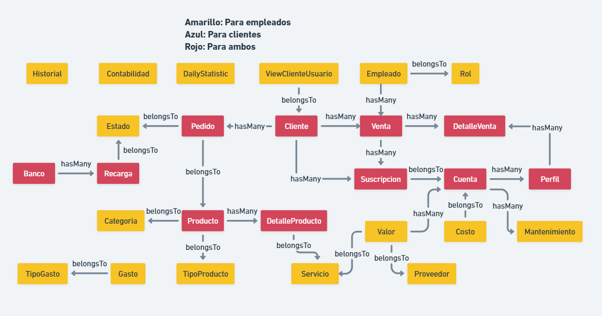

# Limpieza total del sistema

## Registro de estadísticas de ventas en la tabla statistics
para poder eliminar ventas inactivas (con detalles inactivos) hay que registrar desde el día de la primera venta, en la tabla estadísticas, para no perder el historial del negocio, otra información como cuentas, dañadas, clientes, espacios, active users, etc. guardamos valores predeterminados ya que no tenemos esa información:

daily_statistics table: 
'date' : fecha a calcular
'active_users': 100
'usuarios_a_cobrar': 10
'espacios': 10
'cliente_mas_facturado': 1
'total_customers' : 80
'affected_customers' : 5
'pending_payments' : 10
'danger_accounts' : 0
'accounts' : 30
'daily_revenue' : calculado
'daily_cost' : calculado
'daily_bill' : calculado
'daily_sales' : calculado
'new_customers' : 0

## Limpieza de ventas

ya terminado de llenar esta tabla, que tiene todas las estadísticas, entonces podemos borrar ventas muy muy antiguas, que tengan detalles de venta todas inactivas (no se puede eliminar una venta que tenga al menos un detalle activo o con fecha de vencimiento mayor al actual)

## Limpieza de costos, gastos, recargas (con más de 4 meses de antigüedad)

Como los datos financieros ya fueron registrados, podemos eliminar estos registros también que son de mucha carga para la bd, los más antiguos.

## modificación de bd

Como quiero eliminar proveedores, servicios, valores, cuentas, clientes, empleados a mi antojo, no quiero que en la bd se actualicen con estado activo o inactivo, quiero eliminar aquel dato por completo, por lo que necesitaría poder hacerlo.

Cuentas tiene llave foránea en valores, perfiles, costos, mantenimientos
Ventas tiene llave foránea en detalles_venta
detalle_ventas usa llave foránea de perfiles
perfiles usa llave foránea de cuentas
valores tiene llave foránea en proveedores y servicios

Entonces cuando creo una venta de cuentas que por ahora funcionan, existen, todo bien, pero pasar un tiempo, esas cuentas están vacías, y quiero eliminarlas, pero no puedo porque si lo hago, se eliminan sus perfiles, y esos perfiles no se pueden eliminar porque están registrados en los detalles de ventas, las ventas no puedo eliminar porque no tendría historial, todo un caos.

Lo que quiero es, que me permita eliminar todo esto, o que detalle_venta pueda tener perfil null (solamente si este detalle está inactivo), si el detalle está activo entonces ahí está bien que no permita, el costo también que permita almacenar null, o que almacene texto cuenta borrada. La cuenta no se puede eliminar si tiene usuarios usandola (detalle_venta activos)

cuando quiero eliminar un valor, que no me permita si aun no está eliminado proveedor o servicio, o hay cuentas activas de este valor.

que un servicio no se pueda eliminar solo si hay un valor activo que usa este servicio (valor existe), lo mismo para proveedor

entiendes como quiero hacer??? ventas, costos que puedan almacenar perfiles y cuentas null para poder eliminar a gusto todo lo demás, y limpiar el sistema o la bd, es decir que sean independientes, de ahí si está bien que cuentas tenga llave no null de valor, que valor no se pueda poner null en proveedor y servicio, pero para el caso de costos, detalles_venta quiero que pueda almacenar cuenta null y perfil null respectivamente para que las ventas estén ahí, como un historial de streamify

