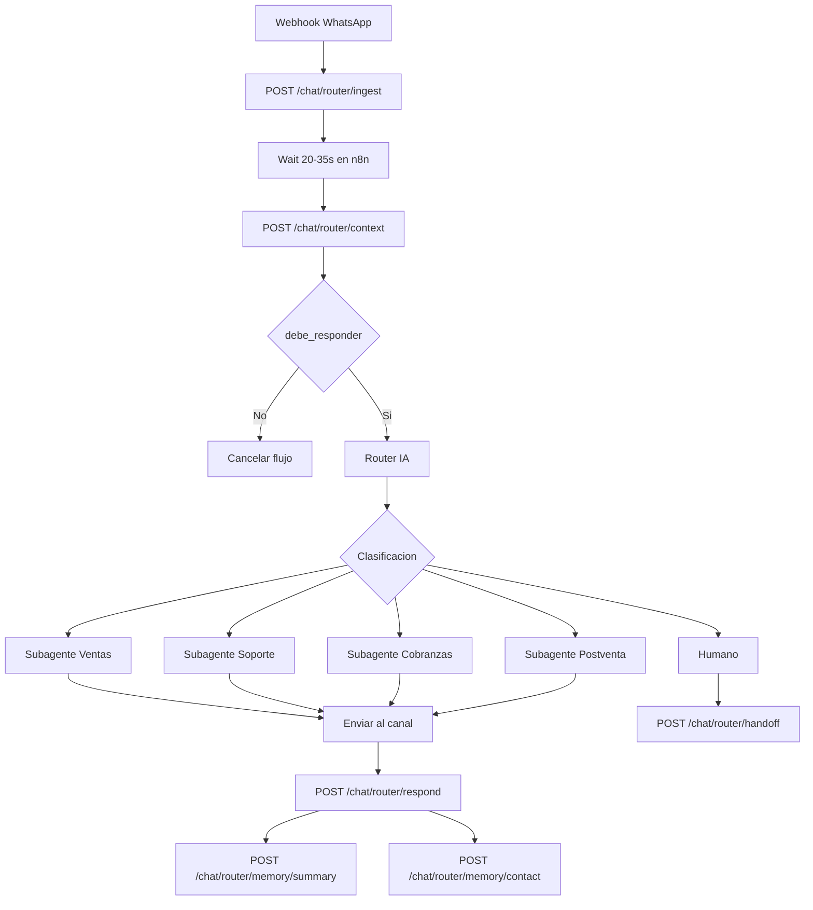

# ¿Como responderá el agente?
Tenía este primer borrador, lo que hace es recibir y guardar mensajes en memoria, esperar unos segundos hasta que la persona termine de escribir, y agrupar todos los mensajes, solo se responde una sola vez a todo este grupo de mensajes, unificando a todo el grupo en un solo mensaje, para controlar mensajes de este tipo:
Hola
Quiero netflix
por favor
cuanto es?

Entonces esto controla muy bien para esos casos, lo que quiero es que no quiero usar mysql (aquí estoy usando una tabla llamada historial_chats_pablinn) la cual es una tabla de mi chat personal, no tiene nada que ver con el negocio, entonces quiero adaptar para Streamify, este proyecto.

En lugar de usar mysql usaría apis, para guardar mensaje, y para recibir grupo de mensajes englobados.

También quiero que el historial de chats de los clientes, se guarde que respuesta se le dió por parte del agente, para que el agente entienda todo el contexto, y pueda ser una conversación real.

## Borrador 1 del agente, lógica de respuesta
{
  "nodes": [
    {
      "parameters": {
        "promptType": "define",
        "text": "={{ $json.prompt }}",
        "options": {
          "systemMessage": "=Eres mi asistente personal de WhatsApp.\n\nEl usuario puede enviar varios mensajes seguidos, ya están agrupados.\n\nHistorial reciente del chat:\n{{ $json.historial }}\n\nResponde de forma natural, como si fueras yo: mensaje corto (max 60 caracteres), preciso, amigable"
        }
      },
      "type": "@n8n/n8n-nodes-langchain.agent",
      "typeVersion": 3.1,
      "position": [
        160,
        -1376
      ],
      "id": "207fd503-e7ae-4325-9c07-6f0287a0b68d",
      "name": "AI Agent"
    },
    {
      "parameters": {
        "method": "POST",
        "url": "={{ $('Edit Fields').item.json.url_server }}/message/sendText/{{ $('detectar').item.json.instance_name }}",
        "sendHeaders": true,
        "headerParameters": {
          "parameters": [
            {
              "name": "apiKey",
              "value": "85546B064571-4564-B802-A60756F68EB8"
            }
          ]
        },
        "sendBody": true,
        "bodyParameters": {
          "parameters": [
            {
              "name": "number",
              "value": "={{ $('Edit Fields').item.json.chat_id }}"
            },
            {
              "name": "text",
              "value": "={{ $json.output }}"
            }
          ]
        },
        "options": {}
      },
      "type": "n8n-nodes-base.httpRequest",
      "typeVersion": 4.4,
      "position": [
        400,
        -1376
      ],
      "id": "80aecd7b-a214-46ec-b460-2b1a4fce1625",
      "name": "Enviar mensaje"
    },
    {
      "parameters": {
        "amount": 35
      },
      "type": "n8n-nodes-base.wait",
      "typeVersion": 1.1,
      "position": [
        -416,
        -1376
      ],
      "id": "7686d15f-d730-49f7-96b3-faa89068efd0",
      "name": "Wait4",
      "webhookId": "6516dd11-1b82-4935-999d-13a1354c57f2"
    },
    {
      "parameters": {
        "jsCode": "const mensajes = items.map(i => i.json);\n\n// ordenar por fecha DESC (más reciente primero)\nmensajes.sort((a, b) => {\n  return new Date(b.created_at) - new Date(a.created_at);\n});\n\nconst ultimo = mensajes[0];\n\n// mensaje actual (el que disparó el flujo)\nconst actual = $('Edit Fields').first().json.mensaje;\n\n// ⚠️ comparar\nif (ultimo.mensaje !== actual) {\n  return []; // ❌ NO eres el último → cancelar\n}\n\n// ✅ eres el último → continuar\nreturn [{\n  mensajes\n}];"
      },
      "type": "n8n-nodes-base.code",
      "typeVersion": 2,
      "position": [
        -192,
        -1376
      ],
      "id": "05d7c48f-1cce-4cf5-a4e0-f5151b0be055",
      "name": "¿último mensaje?"
    },
    {
      "parameters": {
        "jsCode": "const mensajes = [...$json.mensajes];\n\n// ordenar correctamente usando fecha\nmensajes.sort((a, b) => {\n  return new Date(a.createdAt) - new Date(b.createdAt);\n});\n\n// separar\nconst noLeidos = mensajes.filter(m => !m.leido);\nconst leidos = mensajes.filter(m => m.leido);\n\n// historial limitado\nconst historial = leidos.slice(-10);\n\n// construir textos\nconst prompt = noLeidos.map(m => m.mensaje).join('\\n');\n\nreturn [\n  {\n    json: {\n      prompt,\n      historial: historial.map(m => m.mensaje).join('\\n')\n    }\n  }\n];"
      },
      "type": "n8n-nodes-base.code",
      "typeVersion": 2,
      "position": [
        48,
        -1376
      ],
      "id": "681ff2ed-b968-47c6-b38c-378a94e6986a",
      "name": "mensajes"
    },
    {
      "parameters": {
        "conditions": {
          "options": {
            "caseSensitive": true,
            "leftValue": "",
            "typeValidation": "strict",
            "version": 3
          },
          "conditions": [
            {
              "id": "63e391d1-bf5c-461e-be7b-39ee87653eb1",
              "leftValue": "={{ $json.mensajes }}",
              "rightValue": "",
              "operator": {
                "type": "array",
                "operation": "notEmpty",
                "singleValue": true
              }
            }
          ],
          "combinator": "and"
        },
        "options": {}
      },
      "type": "n8n-nodes-base.if",
      "typeVersion": 2.3,
      "position": [
        -80,
        -1376
      ],
      "id": "9bfa491d-d957-4b11-ae07-f1d509e7b33f",
      "name": "If"
    },
    {
      "parameters": {
        "options": {}
      },
      "type": "@n8n/n8n-nodes-langchain.lmChatDeepSeek",
      "typeVersion": 1,
      "position": [
        160,
        -1232
      ],
      "id": "923f40c5-229b-4661-b662-6ee996da65c3",
      "name": "DeepSeek",
      "credentials": {
        "deepSeekApi": {
          "id": "miOzEyelkvZ6G51F",
          "name": "DeepSeek account 2"
        }
      }
    },
    {
      "parameters": {
        "sessionIdType": "customKey",
        "sessionKey": "={{ $('Edit Fields').item.json.chat_id }}"
      },
      "type": "@n8n/n8n-nodes-langchain.memoryBufferWindow",
      "typeVersion": 1.3,
      "position": [
        256,
        -1232
      ],
      "id": "27c0e684-b3e6-4c35-aaff-de6324bdbbdb",
      "name": "Memory"
    },
    {
      "parameters": {
        "table": {
          "__rl": true,
          "value": "historial_chat_pablinn",
          "mode": "list",
          "cachedResultName": "historial_chat_pablinn"
        },
        "dataMode": "defineBelow",
        "valuesToSend": {
          "values": [
            {
              "column": "chat_id",
              "value": "={{ $json.chat_id }}"
            },
            {
              "column": "mensaje",
              "value": "={{ $json.mensaje }}"
            },
            {
              "column": "leido",
              "value": "false"
            },
            {
              "column": "created_at",
              "value": "={{ $now }}"
            }
          ]
        },
        "options": {}
      },
      "type": "n8n-nodes-base.mySql",
      "typeVersion": 2.5,
      "position": [
        -528,
        -1376
      ],
      "id": "f3bdf59b-edcb-4033-a065-3643eb75dfd8",
      "name": "Insert rows in a table",
      "credentials": {
        "mySql": {
          "id": "Z7O4VnXABWDYwHPY",
          "name": "MySQL account"
        }
      }
    },
    {
      "parameters": {
        "operation": "select",
        "table": {
          "__rl": true,
          "value": "historial_chat_pablinn",
          "mode": "list",
          "cachedResultName": "historial_chat_pablinn"
        },
        "limit": 20,
        "where": {
          "values": [
            {
              "column": "chat_id",
              "value": "={{ $('detectar').item.json.chat_id }}"
            }
          ]
        },
        "sort": {
          "values": [
            {
              "column": "created_at",
              "direction": "DESC"
            }
          ]
        },
        "options": {}
      },
      "type": "n8n-nodes-base.mySql",
      "typeVersion": 2.5,
      "position": [
        -304,
        -1376
      ],
      "id": "3cd10efb-ca2f-41a1-8a14-f07ec839de50",
      "name": "Select rows from a table",
      "credentials": {
        "mySql": {
          "id": "Z7O4VnXABWDYwHPY",
          "name": "MySQL account"
        }
      }
    },
    {
      "parameters": {
        "operation": "update",
        "table": {
          "__rl": true,
          "value": "historial_chat_pablinn",
          "mode": "list",
          "cachedResultName": "historial_chat_pablinn"
        },
        "dataMode": "defineBelow",
        "columnToMatchOn": "chat_id",
        "valueToMatchOn": "={{ $('detectar').item.json.chat_id }}",
        "valuesToSend": {
          "values": [
            {
              "column": "leido",
              "value": "1"
            }
          ]
        },
        "options": {}
      },
      "type": "n8n-nodes-base.mySql",
      "typeVersion": 2.5,
      "position": [
        512,
        -1376
      ],
      "id": "073ead51-184f-41f6-82c3-9d0e13c2768d",
      "name": "Update rows in a table",
      "credentials": {
        "mySql": {
          "id": "Z7O4VnXABWDYwHPY",
          "name": "MySQL account"
        }
      }
    }
  ],
  "connections": {
    "AI Agent": {
      "main": [
        [
          {
            "node": "Enviar mensaje",
            "type": "main",
            "index": 0
          }
        ]
      ]
    },
    "Enviar mensaje": {
      "main": [
        [
          {
            "node": "Update rows in a table",
            "type": "main",
            "index": 0
          }
        ]
      ]
    },
    "Wait4": {
      "main": [
        [
          {
            "node": "Select rows from a table",
            "type": "main",
            "index": 0
          }
        ]
      ]
    },
    "¿último mensaje?": {
      "main": [
        [
          {
            "node": "If",
            "type": "main",
            "index": 0
          }
        ]
      ]
    },
    "mensajes": {
      "main": [
        [
          {
            "node": "AI Agent",
            "type": "main",
            "index": 0
          }
        ]
      ]
    },
    "If": {
      "main": [
        [
          {
            "node": "mensajes",
            "type": "main",
            "index": 0
          }
        ]
      ]
    },
    "DeepSeek": {
      "ai_languageModel": [
        [
          {
            "node": "AI Agent",
            "type": "ai_languageModel",
            "index": 0
          }
        ]
      ]
    },
    "Memory": {
      "ai_memory": [
        [
          {
            "node": "AI Agent",
            "type": "ai_memory",
            "index": 0
          }
        ]
      ]
    },
    "Insert rows in a table": {
      "main": [
        [
          {
            "node": "Wait4",
            "type": "main",
            "index": 0
          }
        ]
      ]
    },
    "Select rows from a table": {
      "main": [
        [
          {
            "node": "¿último mensaje?",
            "type": "main",
            "index": 0
          }
        ]
      ]
    }
  },
  "pinData": {},
  "meta": {
    "templateCredsSetupCompleted": true,
    "instanceId": "2a4787fedcd3a9fda6d63f2231359e551e48f7e0d6a6b433946467fe82f7e7a4"
  }
}

## Adaptación a Streamify sin MySQL directo

La idea correcta ya no es que n8n lea y escriba directo sobre una tabla temporal de mensajes. En Streamify ya existe una base de conversación más útil:

- `conversaciones`
- `mensajes`
- `chat_contactos_canal`
- `chat_mensajes_canal`
- `chat_memoria_contactos`
- `chat_memoria_resumenes`
- `chat_subagentes`

Con eso, n8n solo debería hablar con APIs Laravel.

## APIs nuevas para rehacer el flujo

Se agregaron estos endpoints en `api/v2/chat/router`:

### 1. Registrar mensaje entrante

`POST /api/v2/chat/router/ingest`

Sirve para reemplazar el `INSERT` que antes hacías en MySQL.

Guarda:

- el contacto por canal;
- la conversación;
- el mensaje inbound;
- el vínculo externo del canal en `chat_mensajes_canal`.

Ejemplo:

```json
{
  "canal": "whatsapp",
  "canal_user_id": "593961778319@s.whatsapp.net",
  "numero": "593961778319@s.whatsapp.net",
  "nombre": "Aaron",
  "mensaje": "hola cuanto cuesta netflix",
  "external_message_id": "wamid.HBgL...",
  "external_thread_id": "conv-001",
  "payload": {
    "raw": "evento_whatsapp"
  },
  "instance": "streamify-main",
  "api_key": "xxx"
}
```

### 2. Obtener contexto agrupado

`GET|POST /api/v2/chat/router/context`

Sirve para reemplazar el `SELECT`, el `wait`, el chequeo de “¿soy el último mensaje?” y la construcción del prompt.

Devuelve:

- mensajes pendientes sin responder por IA;
- un `mensaje_agrupado` listo para mandar al router;
- historial reciente;
- memorias del contacto;
- resúmenes previos;
- subagentes activos;
- memoria de negocio útil.

Si mandas el `trigger_idmsg` o `external_message_id`, además te responde `debe_responder` para evitar que un mensaje viejo dispare una respuesta tardía.

Ejemplo:

```json
{
  "canal": "whatsapp",
  "canal_user_id": "593961778319@s.whatsapp.net",
  "external_message_id": "wamid.HBgL..."
}
```

### 3. Registrar respuesta del agente

`POST /api/v2/chat/router/respond`

Sirve para reemplazar:

- el envío lógico de respuesta del agente;
- el marcado de mensajes ya procesados;
- el guardado de la respuesta dentro del historial.

Este endpoint:

- crea el mensaje de IA en `mensajes`;
- marca los mensajes pendientes del cliente como `respondido_por_ai = true`;
- registra salida en `chat_mensajes_canal`;
- deja la conversación en `bot_activo`.

Ejemplo:

```json
{
  "idconv": 25,
  "contenido": "Netflix desde $2.50. ¿Te paso personal o compartida?",
  "subagente_codigo": "ventas",
  "external_message_id": "wamid.out.001",
  "external_thread_id": "conv-001",
  "instance": "streamify-main",
  "api_key": "xxx",
  "metadata": {
    "model": "deepseek-chat",
    "intent": "consulta_precio"
  }
}
```

### 4. Derivar a humano

`POST /api/v2/chat/router/handoff`

Sirve para cuando el router o un subagente detecten:

- reclamo;
- enojo;
- pago dudoso;
- soporte complejo;
- cliente que pide asesor.

Deja la conversación en `en_espera` y `requiere_humano = true`.

### 5. Guardar resumen de conversación

`POST /api/v2/chat/router/memory/summary`

Sirve para guardar resúmenes compactos por ventana de conversación y por subagente.

Eso alimenta el contexto real del agente sin tener que reenviar todo el historial crudo siempre.

### 6. Guardar memoria puntual del contacto

`POST /api/v2/chat/router/memory/contact`

Sirve para guardar datos como:

- preferencia de servicio;
- objeciones frecuentes;
- método de pago favorito;
- si ya pidió soporte;
- si le interesan combos;
- si quiere que lo contacten luego.

## Cómo reemplaza tu flujo viejo

Antes hacías esto:

1. Insertar fila en MySQL.
2. Esperar 35 segundos.
3. Leer últimas filas.
4. Revisar si el mensaje actual sigue siendo el último.
5. Unir mensajes no leídos.
6. Responder.
7. Marcar leídos.

Ahora el flujo recomendado es este:

1. Webhook del canal llama `POST /api/v2/chat/router/ingest`.
2. `Wait` de n8n 20 a 35 segundos.
3. n8n llama `POST /api/v2/chat/router/context` con el `external_message_id` o `idmsg` que disparó el flujo.
4. Si `debe_responder = false`, cortar el flujo.
5. Si `debe_responder = true`, mandar `mensaje_agrupado`, `historial_reciente`, `resumenes`, `memorias_contacto` y `memoria_negocio` al router.
6. El router decide subagente.
7. El subagente construye la respuesta.
8. n8n envía al canal externo.
9. n8n registra la respuesta con `POST /api/v2/chat/router/respond`.
10. Si hubo aprendizaje útil, guardar `summary` o `memory/contact`.

## Router y subagentes

El router no debería responder todo. Su trabajo es clasificar y mandar al subagente correcto.

Subagentes mínimos recomendados:

- `router_general`: clasifica intención.
- `vendedor_cierre`: precios, combos, cierres, objeciones.
- `soporte_cliente`: fallas, acceso, cuentas caídas, incidencias.
- `postventa_reciente`: renovaciones, cambios, seguimiento.
- `cobranzas_pago`: pagos, comprobantes, validación, saldo.
- `espera_humano`: salida operativa cuando toca escalar.

Alias tolerados por la API para simplificar n8n:

- `router` -> `router_general`
- `ventas` -> `vendedor_cierre`
- `soporte` -> `soporte_cliente`
- `postventa` -> `postventa_reciente`
- `cobranzas` -> `cobranzas_pago`
- `humano` -> `espera_humano`

Las rutas `api/v2/chat/router/*` ahora deben autenticarse con `X-API-Key` o con `api_key` en el body/query. Ya no conviene enviar ni guardar `apikey` como dato de conversación.

### Gráfico pequeño



## Qué gana esta arquitectura

- ya no dependes de MySQL directo dentro de n8n;
- todo el historial queda dentro de Streamify;
- la respuesta del agente también queda guardada;
- puedes mezclar WhatsApp, Messenger, Telegram o webchat con el mismo backend;
- puedes tener memoria real por contacto y por conversación;
- puedes hacer handoff humano sin romper el historial.

## Recomendación práctica para rehacer tu flujo hoy

Primera versión estable:

1. `ingest`
2. `wait`
3. `context`
4. `router`
5. `subagente`
6. envío al proveedor de WhatsApp
7. `respond`

Segunda fase:

1. `memory/summary`
2. `memory/contact`
3. reglas de handoff
4. router con criterios por `chat_subagentes`
