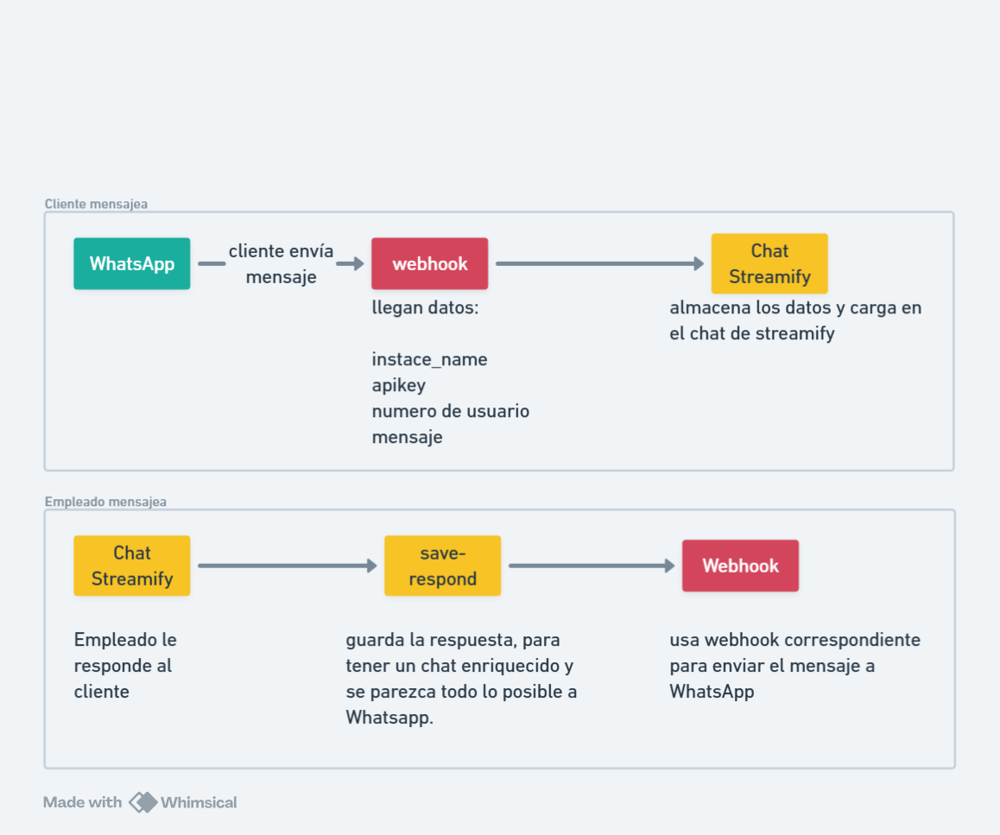

# WhatsApp integrado en Streamify

Tengo un requerimiento.
a. todos los chats de whatsapp, del canal que vengan (son dos números de whatsapp de la empresa, whatsapp verde y azul) se guarden en la base de datos de streamify, así cargan los chats en streamify, para escribir desde streamify y así las respuestas del empleado o subagente se envíen y se guarden.

el objetivo de esto es hacer que este negocio sea escalable para tener empleados, actualmente solo puedo conectar a 3 dispositivos en cada whatsapp, no me permite más, ya conocemos a WhatsApp como es, ese es el límite, entonces si todos los chats cargaran a streamify?? de esa forma puedo tener solamente el evo api conectado al whatsapp (1 dispositivo vinculado), pero en streamify tener los agentes que quiera.

## Requisitos que faltan
1. El sistema de mensajes está feo, desordenado, incómodo, y no funcional, haz como si fuera whatsapp, no deberían haber conversaciones cerradas ni abiertas, tal como es whatsapp.
2. cambiaremos la lógica de las personas anónimas, no se llamarán anónimos, sino el número de teléfono de whatsapp, tal y como es WhatsApp.
3. cada mensaje que se envía al cliente, sea del subagente o de un humano empleado atendiendo, se guarda en la base de datos y debe llegar al cliente, dependiendo de que whatsapp escriben.
4. como son dos whatsapp, en el chat global de streamify, se verá un círculo del color del whatsapp del que vienen (si es del verde, verde, si es del azul, azul)
5. tenemos que hacer posible que carguen los audios, imágenes e incluso videos para que sea super bueno, además de los stickers, ya que usaremos el chat de streamify y no Whatsapp directamente.
6. Te dejo el flujo n8n actual, el cual está incompleto, habrá que hacer unas modificaciones al subagente, y al normalizar, para que reciba el proveedor de whatsapp, ¿de que whatsapp viene?
7. cuando un empleado envía mensaje desde chats de streamify, guarda respuesta (save-respond) y también envía mensaje al cliente con el webhook existente: https://autobot.aaronsoft.es/webhook/mensaje-cliente al que enviará instance_name, instance_apikey, numero, y mensaje. Para que se envíe el mensaje correctamente en n8n

## Gráfico de arquitectura de mensajería Streamify

¿Cuáles son estos webhooks?

## Webhooks para usar
Cuando cliente mensajea, puede usar cualquiera de estos webhooks:
1. https://autobot.aaronsoft.es/webhook/asistente-pablin (WhatsApp verde)
2. https://autobot.aaronsoft.es/webhook/whatsapp-azul (WhatsApp azul)
Recordemos que Streamify cuenta con dos cuentas de whatsapp, por lo que el cliente puede provenir de uno de esos, entonces se necesita esta información:
- instance_name
- instance_apikey
- numero_persona
- mensaje

Cuando empleado mensajea, desde Streamify chats (como en la imagen), solo usaría un webhook:
1. https://autobot.aaronsoft.es/webhook/mensaje-cliente 
este webhook necesita lo mismo:
- instance_name
- instance_apikey
- numero_persona
- mensaje

Como pueden ser imágenes, stickers, audios, videos. El sistema de mensajería de Streamify debe soportar estos formatos de archivo (Hacer un whatsapp para Streamify)
- guardar ruta de archivo y almacenar en storage
- chats deben cargar super bien, como WhatsApp
- al abrir un chat, mensajes de cliente van en la parte izquierda y mensajes de respuesta del empleado en la parte derecha, y de otro color (como messenger o WhatsApp)
- el empleado también podría adjuntar imágenes, enviar stickers, audios, etc. Pero esta tendríamos que usarlo más adelante, no es importante por el momento.
- las apis que usa el subagente tendría que guardar el mensaje de respuesta, y verse también en streamify

¿Cuales son las apis que se está usando en n8n para el subagente y también se usará para los chats de Streamify?
1. https://streamify.aaronsoft.es/public/api/v2/chat/router/ingest
2. https://streamify.aaronsoft.es/public/api/v2/chat/router/respond

## Flujo simplificado recomendado (producción)

### 1) Cliente -> WhatsApp -> n8n -> Streamify
- n8n recibe webhook de Evo API (`asistente-pablin` o `whatsapp-azul`).
- n8n normaliza y llama solo a `POST /api/v2/chat/router/ingest`.
- Datos mínimos a enviar desde n8n:
	- `canal=whatsapp`
	- `canal_user_id` (número del cliente)
	- `mensaje` o `media_url`
	- `tipo_contenido`
	- `external_message_id`
	- `external_thread_id`
	- `instance` (nombre de instancia WhatsApp)

### 2) Subagente -> Streamify
- n8n arma respuesta IA y guarda en `POST /api/v2/chat/router/respond`.
- Streamify guarda el mensaje y despacha automáticamente al canal correcto.

### 3) Empleado -> Streamify Chat
- Empleado responde en panel de Streamify.
- Streamify guarda mensaje y despacha automáticamente por:
	- webhook `mensaje-cliente` de n8n (prioridad)
	- fallback a Evo API directo si webhook falla.

### 4) Configuración central (sin repetir secretos en n8n)
- Mantener una sola fuente de verdad en `chat_whatsapp_channels`:
	- `instance_name`
	- `api_key`
	- `server_url`
	- `color` (verde/azul)
	- `is_active`, `outbound_enabled`
- n8n ya no necesita cargar `apikey` en todos los nodos.

### Payload estándar para salida hacia n8n webhook `mensaje-cliente`
Streamify envía:
- `instance_name`
- `instance_apikey`
- `numero`
- `mensaje`
- `tipo_contenido` (cuando aplique)
- `media_url` (cuando aplique)
- `media_mime_type` (cuando aplique)

## Tabla recomendada a agregar
tabla whatsapp
| id | instance_name | api_key | server_url | color |

por el momento hay dos números de whatsApp
1. | id: 1 | instance_name: bot-pagos | api_key: 68E6084D0489-44B9-909A-632E54ACDD64 | server_url: https://evoapi.abigailsoft.com | color: verde |
2. | id: 2 | instance_name: "Streamify Azul" | api_key: 040E38A519FF-405D-9860-D083DFE9754F | server_url: https://evoapi.abigailsoft.com | color: azul |

Para enviar mensajes usemos directamente la api de evo api aquí mismo, sin pasar por n8n
POST https://evoapi.abigailsoft.com/message/sendText/{instance_name}
Headers:
- apiKey: {api_key}
Body:
```json
{
  "number": "{numero}",
  "text": "{mensaje}"
}
```
entonces cuando se responde mensaje a un usuario, además de guardar el mensaje en la base de datos Streamify, también envía en la api de evo api el mensaje al cliente en el whatsapp donde escribió.


Entonces para recibir mensajes de clientes, si usamos n8n, n8n se encarga de guardar los mensajes en la base de datos, del cliente y del whatsapp de donde escribió (la nueva tabla de whatsapp tendría relación con los channels o chats, no sé como está estructuradas esas tablas tendrás que acomodar y explicarme como hiciste).

Y para responder al cliente, se escribe desde chat Streamify, se guarda la respuesta, y se manda ese mensaje al evo api para que el cliente lo pueda ver, de esa forma mientras los clientes chatean por WhatsApp, los empleados chatean por Messenger Streamify, y todo quedaría hecho y listo
