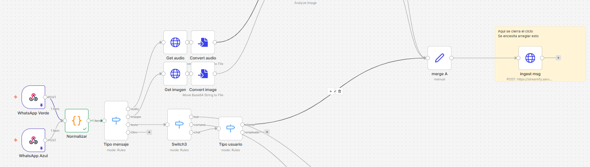

# Tipos de archivo de mensaje
Quiero que el chat streamify también cargue imágenes, audios, o stickers como lo hace whatsapp, como podemos lograrlo??

El flujo de n8n, extrae la imagen y audio, falta de guardar ese mensaje en ingest (actualmente solo guarda texto), entonces ayúdame con eso (además, en la imagen sabe venir texto también, así que la imagen debe mostrar la foto, y el texto normal, ya que ya sabemos que las personas envian imagen y descripcion)

1. hay que hacer un ingest que soporte audio e imágenes, digamos guarda la imagen en storage, así tranquilamente.
2. en el chat de streamify, al cargar la conversación, si el mensaje es de tipo imagen o audio, cargarlo como tal (como whatsapp), y si es texto, cargarlo como texto normal.
## Contexto (flujo actual n8n)
Actualmente, el flujo de n8n para mensajes de WhatsApp es:

como ves en la imagen, el flujo ya obtiene imagen y audio, y el ingest solo está para texto de cliente. ahora como hacemos para imagenes, audios e incluso stickers?

## ingest actualmente
{
  "nodes": [
    {
      "parameters": {
        "method": "POST",
        "url": "https://streamify.aaronsoft.es/public/api/v2/chat/router/ingest",
        "sendBody": true,
        "bodyParameters": {
          "parameters": [
            {
              "name": "telefono",
              "value": "={{ $('Normalizar').item.json.contact.numero }}"
            },
            {
              "name": "mensaje",
              "value": "={{ $('Normalizar').item.json.content }}"
            },
            {
              "name": "canal_user_id",
              "value": "={{ $('Normalizar').item.json.contact.numero }}"
            },
            {
              "name": "canal",
              "value": "=whatsapp"
            },
            {
              "name": "tipo_contenido",
              "value": "={{ $('Normalizar').item.json.message.type }}"
            },
            {
              "name": "external_message_id",
              "value": "={{ $('Normalizar').item.json.message.id }}"
            },
            {
              "name": "external_thread_id",
              "value": "={{ $('Normalizar').item.json.message.chat_id }}"
            },
            {
              "name": "numero",
              "value": "={{ $('Normalizar').item.json.contact.numero }}"
            },
            {
              "name": "instance",
              "value": "={{ $('Normalizar').item.json.instance.name }}"
            },
            {
              "name": "origen",
              "value": "n8n"
            },
            {
              "name": "payload",
              "value": "={{ $('Normalizar').item.json}}"
            },
            {
              "name": "debounce_seconds",
              "value": "35"
            },
            {
              "name": "canal_user_id",
              "value": "={{ $('Normalizar').item.json.contact.numero }}"
            },
            {
              "name": "instance_name",
              "value": "={{ $('Normalizar').item.json.instance.name }}"
            },
            {
              "name": "instance_apikey",
              "value": "={{ $('Normalizar').item.json.instance.apikey }}"
            },
            {
              "name": "server_url",
              "value": "={{ $('Normalizar').item.json.instance.server_url }}"
            }
          ]
        },
        "options": {}
      },
      "type": "n8n-nodes-base.httpRequest",
      "typeVersion": 4.4,
      "position": [
        -272,
        -2112
      ],
      "id": "b13a76be-b08d-493a-bdac-e522682f0f48",
      "name": "ingest msg"
    }
  ],
  "connections": {
    "ingest msg": {
      "main": [
        []
      ]
    }
  },
  "pinData": {},
  "meta": {
    "templateCredsSetupCompleted": true,
    "instanceId": "2a4787fedcd3a9fda6d63f2231359e551e48f7e0d6a6b433946467fe82f7e7a4"
  }
}
