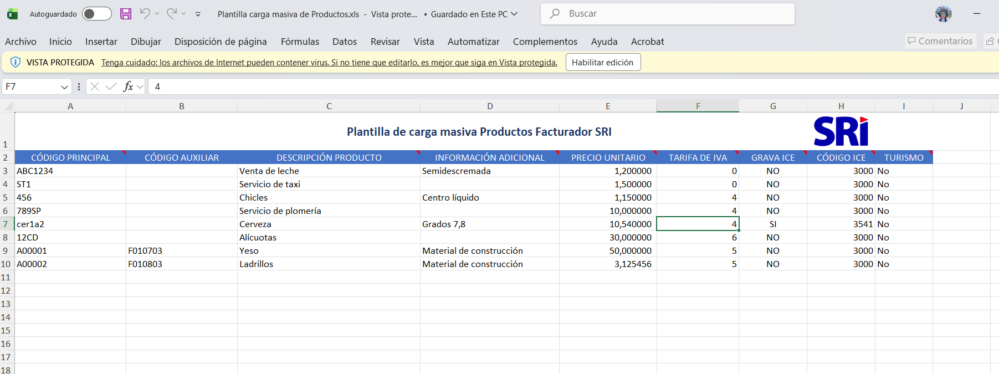

# Exportación de productos
En esta sección se explica cómo exportar los productos de tu tienda en formato xls y xlsx.
los productos serán exportados en ese formato, y además, tienen que censurarse el nombre, (será para el facturador del SRI) en lugar de netflix por ejemplo.

Usa el componente enhanced-table.blade.php para poder exportar el contenido de la tabla,
el formato de exportación masiva del SRI es el siguiente.

## Exportar productos
el nombre de los productos o el código tiene que ser sigiloso, digamos para netflix:
Usa nombre: Gestión de suscripciones.

| Marca real / referencia interna | Código interno | Nombre para facturar                             | Descripción recomendada                                                                  |
| ------------------------------- | -------------: | ------------------------------------------------ | ---------------------------------------------------------------------------------------- |
| Netflix                         |     PD-VID-001 | Membresía digital de entretenimiento audiovisual | Renovación mensual de servicio digital de películas y series solicitado por el cliente   |
| Spotify                         |     PD-AUD-001 | Membresía digital de audio y música              | Gestión mensual de servicio digital de música, audio y podcasts                          |
| Disney                          |     PD-VID-002 | Membresía digital de entretenimiento familiar    | Renovación mensual de servicio digital de películas, series y contenido familiar         |
| Max                             |     PD-VID-003 | Membresía digital audiovisual premium            | Gestión mensual de acceso a servicio digital de películas, series y entretenimiento      |
| Prime Video                     |     PD-VID-004 | Membresía digital de video bajo demanda          | Renovación mensual de servicio digital de video bajo demanda                             |
| Paramount                       |     PD-VID-005 | Membresía digital de películas y series          | Gestión mensual de servicio digital de entretenimiento audiovisual                       |
| Crunchyroll                     |     PD-ANI-001 | Membresía digital de anime y entretenimiento     | Renovación mensual de servicio digital de anime, series animadas y contenido audiovisual |
| Flujo TV                        |      PD-TV-001 | Servicio digital de televisión por streaming     | Gestión mensual de acceso a servicio digital de televisión y canales por internet        |
