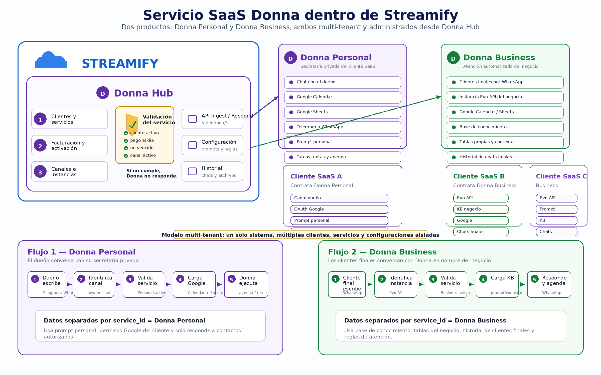

# Implementación de Donna SaaS dentro de Streamify — Versión 2

## 1. Contexto del proyecto

Streamify ya cuenta con base de datos, vistas administrativas, clientes existentes, flujos en n8n y conexión con Evo API. El objetivo ahora es convertir a **Donna** en un módulo SaaS multi-cliente dentro de Streamify, sin reconstruir todo desde cero.

La arquitectura debe soportar dos servicios diferentes de Donna:

1. **Donna Personal**: secretaria privada del cliente SaaS. El dueño del negocio habla directamente con Donna para agenda, tareas, notas, recordatorios, Calendar y Sheets.
2. **Donna Business**: secretaria/asesora del negocio. Donna responde a los clientes finales del cliente SaaS por WhatsApp, usando contexto, base de conocimiento, reglas de negocio, Calendar, Sheets e historial.

La meta principal es que Streamify administre clientes, servicios, configuraciones, credenciales, canales, historial y validación comercial; mientras que n8n funcione como un flujo genérico reutilizable, sin duplicarse por cada cliente.


---

## 2. Regla principal para Claude Code Agent

Antes de crear archivos nuevos, Claude Code debe inspeccionar el proyecto actual.

Prioridad de trabajo:

1. Reutilizar las tablas existentes cuando sea posible.
2. Reutilizar vistas, layouts, controladores, rutas y estilos existentes de Streamify.
3. Reutilizar el flujo actual de n8n y Evo API, pero convertirlo en multi-cliente y multi-servicio.
4. Evitar hardcodear prompts, credenciales, números de teléfono o reglas de negocio dentro de n8n.
5. Mover la configuración variable de Donna hacia Streamify.
6. Mantener n8n como motor de automatización genérico.
7. Crear migraciones nuevas solo para datos que no existan actualmente.
8. No romper los clientes actuales de Streamify.
9. Separar claramente los datos de **Donna Personal** y **Donna Business**.
10. Guardar credenciales sensibles cifradas.

La implementación debe ser incremental y compatible con lo que ya existe.

---

## 3. Visión funcional de Donna

Donna será un módulo SaaS dentro de Streamify, administrado desde una sección llamada **Donna Hub**.

Streamify administra:

- Clientes que contratan Donna.
- Tipo de servicio contratado: `personal` o `business`.
- Estado comercial del servicio.
- Fechas de activación y vencimiento.
- Instancias de Evo API por cliente.
- Canales WhatsApp o Telegram.
- Prompts personalizados.
- Contexto del negocio.
- Lógica de negocio.
- Base de conocimiento.
- Tablas propias del cliente.
- Credenciales OAuth de Google Calendar y Google Sheets.
- Historial de chats.
- Mensajes multimedia.
- Logs de errores.
- Activación o suspensión del servicio.

---

## 4. División oficial del producto

### 4.1 Donna Personal

Donna Personal es una secretaria privada para el dueño del negocio o cliente SaaS.

El cliente habla directamente con Donna desde WhatsApp o Telegram.

Ejemplos de uso:

```text
“Donna, agenda una reunión con Fernando mañana a las 10.”
“Donna, anota este cliente en mi hoja de seguimiento.”
“Donna, recuérdame llamar a María el viernes.”
“Donna, revisa si tengo espacio mañana en la tarde.”
```

Necesita:

```text
- Usuario/cliente en Streamify
- Servicio Donna Personal activo
- Canal personal: Telegram o WhatsApp
- Google OAuth del cliente
- Permisos de Calendar
- Permisos de Sheets
- Prompt personal
- Reglas personales
- Historial del chat con el dueño
```

Características:

```text
- No responde a clientes finales.
- Está orientada a productividad personal.
- Puede tener un chat único con el dueño.
- Puede trabajar con Calendar y Sheets del cliente.
- Puede guardar tareas, notas y eventos.
```

---

### 4.2 Donna Business

Donna Business es la secretaria/asesora que responde a los clientes finales del negocio.

Los clientes finales escriben al WhatsApp del negocio y Donna responde en nombre de ese negocio.

Ejemplos de uso:

```text
Cliente final: “Hola, quiero una cita para mañana.”
Donna: “Claro, tengo disponible a las 10:00 o 15:30. ¿Cuál prefieres?”

Cliente final: “¿Cuánto cuesta el servicio?”
Donna: responde usando la base de conocimiento del negocio.
```

Necesita:

```text
- Cliente SaaS / negocio en Streamify
- Servicio Donna Business activo
- Instancia WhatsApp del negocio mediante Evo API
- Google OAuth del negocio
- Permisos de Calendar
- Permisos de Sheets si aplica
- Base de conocimiento
- Tablas propias del negocio
- Prompt personalizado del negocio
- Reglas de atención
- Historial de chats con clientes finales
```

Características:

```text
- Responde a múltiples clientes finales.
- Usa base de conocimiento y contexto del negocio.
- Puede agendar citas en Calendar del negocio.
- Puede registrar información en Sheets o tablas internas.
- Puede escalar a humano cuando no sabe responder.
```

---

## 5. Modelo multi-tenant esperado

El sistema debe comportarse como multi-tenant lógico.

Eso significa:

```text
Un solo Streamify
Un solo Donna Hub
Un proyecto OAuth de Google de Streamify/Aaronsoft
Un flujo n8n genérico
Muchos clientes SaaS
Múltiples servicios por cliente
Múltiples canales por servicio
Datos aislados por client_id y service_id
```

Cada mensaje entrante debe poder responder estas preguntas:

1. ¿Desde qué proveedor llegó? `evolution_api`, `telegram`, etc.
2. ¿Desde qué instancia o canal llegó?
3. ¿A qué cliente de Streamify pertenece esa instancia?
4. ¿Ese mensaje corresponde a Donna Personal o Donna Business?
5. ¿Ese cliente tiene el servicio activo?
6. ¿El pago está al día?
7. ¿El servicio no está vencido?
8. ¿Qué prompt, contexto y herramientas debo cargar?
9. ¿Dónde debo guardar el chat?
10. ¿Por qué canal debo responder?

---

## 6. Principio clave de credenciales

El cliente final **no debe crear Google Cloud**, ni habilitar APIs, ni configurar OAuth, ni tocar n8n.

Todo eso lo hace Streamify/Aaronsoft una sola vez.

El cliente solo debe:

```text
1. Entrar al panel de Streamify.
2. Presionar “Conectar Google”.
3. Aceptar permisos de Calendar y Sheets.
4. Conectar WhatsApp o Telegram según el servicio.
5. Configurar sus reglas, prompt y datos del negocio.
```

Para Google, nunca se debe pedir contraseña del cliente. Se usa OAuth:

```text
Correcto:
cliente autoriza con Google OAuth y Streamify guarda tokens cifrados.

Incorrecto:
pedir correo y contraseña de Google al cliente.
```

Para Evo API, Telegram, OpenAI, DeepSeek u otros proveedores, cualquier API key o token debe guardarse cifrado.

---

## 7. Entidades principales

### 7.1 Cliente

La tabla de clientes ya existe. No crear otra tabla de clientes si ya hay una.

Claude Code debe identificar la tabla real, por ejemplo:

```text
clientes
clients
customers
users
```

Esta tabla será la base para asociar servicios Donna.

Si el cliente actual solo estaba pensado para streaming, no eliminar nada. Solo extender mediante relaciones nuevas.

---

### 7.2 Servicios contratados por cliente

Se necesita representar que un cliente tiene contratado Donna Personal, Donna Business o ambos.

Crear una tabla nueva solo si no existe una tabla de servicios, suscripciones, ventas recurrentes o contratos.

Nombre sugerido si no existe:

```text
client_services
```

Campos sugeridos:

```text
id
client_id
service_code              // donna_personal, donna_business, streaming, software, hosting, etc.
service_name              // Donna Personal, Donna Business, etc.
service_type              // personal, business, other
status                    // active, suspended, expired, cancelled
billing_cycle             // monthly, yearly, one_time
price
currency                  // USD
starts_at
expires_at
last_payment_at
next_payment_due_at
is_enabled
suspended_reason
created_at
updated_at
```

Ejemplo Donna Personal:

```text
client_id: 123
service_code: donna_personal
service_name: Donna Personal
service_type: personal
status: active
is_enabled: true
expires_at: 2026-06-24
```

Ejemplo Donna Business:

```text
client_id: 123
service_code: donna_business
service_name: Donna Business
service_type: business
status: active
is_enabled: true
expires_at: 2026-06-24
```

Regla:

```text
Donna solo puede responder si el servicio está activo, habilitado y no vencido.
```

---

### 7.3 Canales e instancias Donna

Cada servicio puede tener uno o varios canales.

Tabla sugerida si no existe:

```text
donna_channels
```

Campos sugeridos:

```text
id
client_id
service_id
service_type              // personal, business
channel_type              // whatsapp, telegram
provider                  // evolution_api, baileys, telegram_bot, etc.
instance_name             // nombre de instancia en Evo API, si aplica
phone_number              // número asociado, si aplica
owner_identifier          // teléfono/chat_id autorizado para Donna Personal
audience_type             // owner, final_customer
api_base_url              // URL de Evo API o proveedor
api_key_encrypted         // API key cifrada
webhook_url
status                    // active, inactive, error, suspended
is_default
last_connected_at
last_error
metadata_json
created_at
updated_at
```

Reglas:

```text
Donna Personal:
- audience_type = owner
- solo debe responder al dueño o números autorizados.
- puede usar Telegram o WhatsApp.

Donna Business:
- audience_type = final_customer
- responde a clientes finales del negocio.
- normalmente usa WhatsApp vía Evo API.
```

No guardar API keys en texto plano.

---

### 7.4 Configuración del agente Donna

Cada servicio debe tener su propio prompt, contexto y reglas.

Tabla sugerida:

```text
donna_agent_configs
```

Campos sugeridos:

```text
id
client_id
service_id
service_type              // personal, business
agent_name                // Donna, Secretaria, Asistente, etc.
business_name
business_description
personal_context          // especialmente para Donna Personal
business_context          // especialmente para Donna Business
business_logic
main_prompt
fallback_prompt
welcome_message
out_of_hours_message
tone                      // formal, amable, cercano, profesional, etc.
language                  // es, en, etc.
timezone                  // America/Guayaquil por defecto
working_hours_json
human_handoff_message
is_active
created_at
updated_at
```

La idea es que n8n ya no tenga prompts personalizados por cliente.

n8n debe consultar a Streamify:

```http
GET /api/donna/context?instance_name=clinica_fernando_01&sender=593999999999
```

Y Streamify debe devolver:

```json
{
  "allowed": true,
  "client_id": 123,
  "service_id": 45,
  "service_type": "business",
  "service_status": "active",
  "channel_id": 8,
  "agent_name": "Donna",
  "business_name": "Clínica Dental Fernando",
  "main_prompt": "...",
  "business_context": "...",
  "business_logic": "...",
  "google_calendar_enabled": true,
  "google_sheets_enabled": true
}
```

---

### 7.5 Integraciones y credenciales

Cada servicio puede tener integraciones propias.

Tabla sugerida:

```text
donna_integrations
```

Campos sugeridos:

```text
id
client_id
service_id
service_type              // personal, business
integration_type          // google_calendar, google_sheets, openai, deepseek, evolution_api, telegram
name
credentials_encrypted
access_token_encrypted
refresh_token_encrypted
token_expires_at
scopes_json
status                    // active, expired, revoked, error
last_sync_at
last_error
metadata_json
created_at
updated_at
```

Reglas:

```text
- Nunca mostrar tokens completos en la interfaz.
- Nunca guardar tokens en texto plano.
- Permitir desconectar Google.
- Permitir marcar una integración como vencida o con error.
- Si Google Calendar falla, Donna debe responder sin agendar o escalar a humano.
```

---

### 7.6 Base de conocimiento

Donna Business necesita base de conocimiento por negocio. Donna Personal puede tener notas o memoria personal, pero no necesariamente una base grande.

Tabla sugerida:

```text
donna_knowledge_bases
```

Campos:

```text
id
client_id
service_id
name
description
status
created_at
updated_at
```

Tabla sugerida:

```text
donna_knowledge_items
```

Campos:

```text
id
knowledge_base_id
client_id
service_id
type                       // text, pdf, image, audio, url, faq, table
source_title
content_text
file_path
embedding_id
metadata_json
status
created_at
updated_at
```

Reglas:

```text
- Todo knowledge_item debe tener client_id y service_id.
- Si es imagen o audio, guardar archivo y transcripción textual cuando exista.
- No mezclar base de conocimiento entre clientes.
```

---

### 7.7 Conversaciones

Una conversación agrupa mensajes.

Tabla sugerida:

```text
donna_conversations
```

Campos sugeridos:

```text
id
client_id
service_id
service_type              // personal, business
channel_id
conversation_type         // owner_chat, final_customer_chat
external_chat_id          // id del chat en WhatsApp/Telegram
sender_identifier         // teléfono, username, chat_id, etc.
sender_name
status                    // open, closed, pending, human_takeover, blocked
last_message_at
last_message_preview
assigned_to_user_id       // opcional, para atención humana
metadata_json
created_at
updated_at
```

Reglas:

```text
Donna Personal:
- conversation_type = owner_chat
- normalmente conversa con el dueño.

Donna Business:
- conversation_type = final_customer_chat
- conversa con clientes finales del negocio.
```

---

### 7.8 Mensajes

Cada mensaje entrante o saliente debe guardarse.

Tabla sugerida:

```text
donna_messages
```

Campos sugeridos:

```text
id
conversation_id
client_id
service_id
service_type
channel_id
direction                 // inbound, outbound
message_type              // text, audio, image, video, document, sticker, location, contact, system
provider_message_id
content_text
media_url
media_mime_type
media_size
transcription_text
ocr_text
ai_response_text
processing_status         // received, stored, processing, responded, failed, blocked_service_inactive
blocked_reason
raw_payload_json
created_at
updated_at
```

Reglas:

```text
- Guardar siempre el mensaje entrante aunque Donna no responda.
- Si el servicio está vencido, guardar el mensaje con estado blocked_service_inactive.
- Guardar el payload original de Evo API para depuración.
- Para audios, guardar transcripción.
- Para imágenes, guardar texto extraído si luego se implementa OCR.
```

---

### 7.9 Archivos multimedia

Si el proyecto ya tiene manejo de archivos, usarlo.

Si no existe, tabla sugerida:

```text
donna_media_files
```

Campos sugeridos:

```text
id
message_id
client_id
service_id
service_type
channel_id
file_type                 // audio, image, video, document
original_filename
storage_path
public_url
mime_type
size_bytes
checksum
transcription_text
ocr_text
metadata_json
created_at
updated_at
```

Reglas:

```text
- Evitar guardar archivos pesados directamente en la base de datos.
- Guardar rutas o URLs.
- Considerar límites por cliente en el futuro.
```

---

## 8. Middleware de activación del servicio Donna

Este es el punto más importante del SaaS.

Antes de que Donna procese cualquier mensaje, Streamify debe validar si el cliente tiene derecho a usar el servicio.

### 8.1 Condiciones mínimas

Donna puede responder solo si:

```text
cliente existe
cliente está activo
canal existe
canal está activo
servicio Donna existe
servicio Donna está activo
servicio Donna está habilitado
fecha actual <= expires_at
configuración del agente activa
credenciales mínimas disponibles según el tipo de servicio
```

Condiciones adicionales para Donna Personal:

```text
sender_identifier coincide con el dueño o con un contacto autorizado
servicio_type = personal
conversation_type = owner_chat
```

Condiciones adicionales para Donna Business:

```text
service_type = business
canal del negocio activo
base de conocimiento o contexto mínimo disponible
```

### 8.2 Si cumple

El flujo continúa:

```text
mensaje recibido
→ guardar mensaje
→ cargar configuración del cliente y del servicio
→ enviar contexto a n8n/IA
→ generar respuesta
→ ejecutar herramientas si aplica
→ enviar respuesta por Evo API/Telegram
→ guardar respuesta
```

### 8.3 Si no cumple

El sistema debe:

```text
mensaje recibido
→ identificar cliente/canal si es posible
→ guardar mensaje entrante
→ marcar como blocked_service_inactive o similar
→ NO llamar a OpenAI/DeepSeek
→ NO ejecutar lógica de Donna
→ opcional: notificar al administrador o dueño del negocio
```

Opciones de bloqueo configurables:

```text
no_reply
generic_unavailable_message
notify_business_owner
notify_streamify_admin
```

Mensaje genérico opcional:

```text
Por el momento este canal de atención no se encuentra disponible. Por favor intenta más tarde.
```

---

## 9. Flujo esperado con Evo API, Telegram, n8n y Streamify

### 9.1 Flujo Donna Personal

```text
Dueño escribe por Telegram/WhatsApp
        ↓
Telegram Bot o Evo API recibe mensaje
        ↓
Webhook hacia n8n o Streamify
        ↓
Streamify identifica canal personal
        ↓
Streamify valida Donna Personal
        ↓
Streamify guarda mensaje
        ↓
n8n obtiene contexto personal y herramientas disponibles
        ↓
Donna procesa instrucción
        ↓
Donna puede usar Google Calendar o Sheets
        ↓
Donna responde al dueño
        ↓
Streamify guarda respuesta
```

### 9.2 Flujo Donna Business

```text
Cliente final escribe al WhatsApp del negocio
        ↓
Evo API recibe mensaje
        ↓
Webhook hacia n8n o Streamify
        ↓
Streamify identifica instancia del negocio
        ↓
Streamify valida Donna Business
        ↓
Streamify guarda mensaje
        ↓
n8n obtiene prompt, base de conocimiento y reglas del negocio
        ↓
Donna responde, agenda o registra datos
        ↓
Respuesta por WhatsApp del negocio
        ↓
Streamify guarda respuesta e historial
```

---

## 10. Recomendación arquitectónica

Hay dos opciones válidas.

### Opción A: Evo API / Telegram → Streamify → n8n

Recomendada para control SaaS.

```text
Webhook proveedor
  → Streamify /api/donna/ingest
  → valida servicio
  → guarda mensaje
  → llama webhook n8n si procede
```

Ventajas:

```text
- Streamify controla todo.
- Se guarda el mensaje antes de procesar.
- Se bloquea el uso si el cliente no pagó.
- n8n queda como motor de automatización, no como dueño del negocio.
```

### Opción B: Evo API / Telegram → n8n → Streamify

Puede servir si el flujo actual ya está funcionando y no se quiere cambiar demasiado todavía.

```text
Webhook proveedor
  → n8n
  → n8n llama Streamify para validar y obtener contexto
  → si allowed=true, procesa
  → si allowed=false, detiene flujo
```

Ventajas:

```text
- Menos cambios iniciales.
- Reutiliza el flujo actual.
```

Desventaja:

```text
- n8n sigue recibiendo primero todo.
- Streamify no es el primer punto de control.
```

### Decisión recomendada

Implementar primero la **opción B** si el flujo actual ya está funcionando.

Luego migrar gradualmente a la **opción A**.

---

## 11. Endpoints sugeridos

Adaptar nombres según el framework y estructura actual del proyecto.

### 11.1 Resolver contexto de Donna

```http
GET /api/donna/context
```

Parámetros:

```text
provider
instance_name
sender_identifier
channel_type
```

Respuesta si está permitido:

```json
{
  "allowed": true,
  "client": {
    "id": 123,
    "name": "Clínica Dental Fernando"
  },
  "service": {
    "id": 45,
    "type": "business",
    "status": "active",
    "expires_at": "2026-06-24"
  },
  "channel": {
    "id": 8,
    "type": "whatsapp",
    "provider": "evolution_api",
    "instance_name": "clinica_fernando_01"
  },
  "agent_config": {
    "agent_name": "Donna",
    "business_name": "Clínica Dental Fernando",
    "main_prompt": "...",
    "business_context": "...",
    "business_logic": "...",
    "tone": "profesional y amable"
  },
  "tools": {
    "google_calendar": true,
    "google_sheets": true,
    "knowledge_base": true,
    "internal_tables": true
  }
}
```

Respuesta si no está permitido:

```json
{
  "allowed": false,
  "reason": "service_expired",
  "message": "El servicio Donna está vencido para este cliente."
}
```

---

### 11.2 Ingestar mensaje entrante

```http
POST /api/donna/ingest
```

Body esperado:

```json
{
  "provider": "evolution_api",
  "instance_name": "clinica_fernando_01",
  "external_chat_id": "593999999999@s.whatsapp.net",
  "sender_identifier": "593999999999",
  "sender_name": "Paciente Demo",
  "message_type": "text",
  "content_text": "Hola, quiero una cita",
  "media_url": null,
  "raw_payload": {}
}
```

Responsabilidad:

```text
- Identificar canal.
- Identificar cliente.
- Identificar service_id y service_type.
- Guardar conversación.
- Guardar mensaje.
- Validar servicio.
- Devolver si debe continuar o no.
```

Respuesta:

```json
{
  "stored": true,
  "allowed": true,
  "conversation_id": 50,
  "message_id": 900,
  "client_id": 123,
  "service_id": 45,
  "service_type": "business",
  "channel_id": 8
}
```

---

### 11.3 Guardar respuesta generada

```http
POST /api/donna/respond
```

Body esperado:

```json
{
  "conversation_id": 50,
  "client_id": 123,
  "service_id": 45,
  "service_type": "business",
  "channel_id": 8,
  "content_text": "Claro, ¿qué día te gustaría agendar?",
  "provider_message_id": "ABC123"
}
```

Responsabilidad:

```text
- Guardar mensaje saliente.
- Actualizar conversación.
- Opcionalmente enviar por Evo API si Streamify será quien responda.
```

---

### 11.4 Estado del servicio Donna

```http
GET /api/donna/service-status
```

Parámetros:

```text
client_id
service_id
channel_id
instance_name
```

Respuesta:

```json
{
  "active": true,
  "service_type": "business",
  "status": "active",
  "expires_at": "2026-06-24",
  "days_remaining": 31
}
```

---

### 11.5 Ejecutar herramienta Google Calendar

```http
POST /api/donna/tools/google-calendar/create-event
```

Body esperado:

```json
{
  "client_id": 123,
  "service_id": 45,
  "summary": "Cita con Fernando",
  "start": "2026-06-01T10:00:00-05:00",
  "end": "2026-06-01T10:30:00-05:00",
  "attendees": []
}
```

Responsabilidad:

```text
- Buscar integración Google del service_id.
- Refrescar access token si hace falta.
- Crear evento.
- Registrar resultado.
```

---

### 11.6 Ejecutar herramienta Google Sheets

```http
POST /api/donna/tools/google-sheets/append-row
```

Body esperado:

```json
{
  "client_id": 123,
  "service_id": 45,
  "spreadsheet_id": "...",
  "sheet_name": "Clientes",
  "values": ["Fernando", "0999999999", "Cita agendada"]
}
```

Responsabilidad:

```text
- Buscar integración Google del service_id.
- Refrescar access token si hace falta.
- Insertar fila.
- Registrar resultado.
```

---

## 12. Vistas administrativas dentro de Streamify

No crear un panel separado si Streamify ya tiene un layout administrativo.

Crear módulo:

```text
Donna Hub
```

### 12.1 Vista principal Donna Hub

Debe mostrar:

```text
- Total de clientes con Donna.
- Clientes con Donna Personal.
- Clientes con Donna Business.
- Clientes activos.
- Clientes vencidos.
- Canales activos.
- Mensajes recientes.
- Errores recientes.
- Accesos rápidos.
```

### 12.2 Vista de servicios Donna

Tabla con:

```text
Cliente
Servicio: Personal o Business
Estado
Fecha de vencimiento
Canales conectados
Google conectado
Último mensaje
Acciones
```

Acciones:

```text
Ver configuración
Ver chats
Ver canales
Editar prompt
Conectar Google
Suspender Donna
Renovar servicio
```

### 12.3 Vista de configuración de Donna Personal

Formulario:

```text
Cliente
Nombre del agente
Canal personal autorizado
Reglas personales
Prompt personal
Tono de comunicación
Zona horaria
Google Calendar conectado
Google Sheets conectado
Estado activo/inactivo
```

### 12.4 Vista de configuración de Donna Business

Formulario:

```text
Cliente
Nombre del negocio
Nombre del agente
Qué hace el negocio
Contexto del negocio
Lógica de negocio
Prompt principal
Mensaje de bienvenida
Mensaje fallback
Tono de comunicación
Horario de atención
Base de conocimiento
Tablas propias
Google Calendar conectado
Google Sheets conectado
Estado activo/inactivo
```

### 12.5 Vista de canales

Formulario para crear canal:

```text
Cliente
Servicio asociado
Tipo de servicio: Personal o Business
Tipo de canal
Proveedor
Nombre de instancia Evo API
Número de WhatsApp
Telegram bot token si aplica
API base URL
API key
Estado
```

### 12.6 Vista de chats

Debe permitir:

```text
- Filtrar por cliente.
- Filtrar por servicio: Personal o Business.
- Filtrar por instancia.
- Buscar por teléfono/nombre.
- Ver mensajes entrantes y salientes.
- Ver archivos multimedia.
- Ver transcripciones.
- Ver estado de procesamiento.
- Ver errores.
- Pausar Donna en una conversación.
- Marcar atención humana.
```

---

## 13. Cambios en n8n

El flujo actual de n8n debe dejar de depender de prompts fijos.

### 13.1 Objetivo

n8n debe funcionar como un flujo genérico.

En lugar de esto:

```text
Prompt quemado en n8n para un cliente específico
```

Debe ser:

```text
n8n recibe provider + instance_name + sender
n8n consulta Streamify
n8n obtiene client_id, service_id, service_type, prompt, contexto y herramientas
n8n procesa según el cliente y servicio correctos
```

### 13.2 Nodos mínimos del flujo n8n

```text
1. Webhook / Trigger de Evo API o Telegram
2. Extraer provider, instance_name, sender, message_type, content
3. HTTP Request → Streamify /api/donna/ingest
4. IF allowed == true
5. HTTP Request → Streamify /api/donna/context si hace falta más contexto
6. Procesar audio/imagen/texto si aplica
7. Cargar prompt dinámico según service_type
8. Cargar base de conocimiento si service_type = business
9. Llamar OpenAI/DeepSeek
10. Ejecutar herramientas mediante endpoints Streamify
11. Enviar respuesta por Evo API o Telegram
12. HTTP Request → Streamify /api/donna/respond
13. Manejo de errores/logs
```

### 13.3 Rama cuando allowed=false

Si Streamify devuelve:

```json
{
  "allowed": false
}
```

n8n debe:

```text
no llamar IA
no responder con Donna, salvo que la configuración permita mensaje genérico
registrar evento si aplica
terminar flujo
```

---

## 14. Seguridad

### 14.1 Credenciales

Todas las credenciales sensibles deben estar cifradas:

```text
- API key Evo API.
- Token de Telegram.
- Tokens de Google.
- Tokens de OpenAI/DeepSeek si se guardan por cliente.
- Refresh tokens.
```

Nunca mostrar credenciales completas en vistas.

Mostrar solo versión enmascarada:

```text
sk-****abcd
```

### 14.2 Aislamiento de datos

Todas las consultas de Donna deben filtrar por:

```text
client_id
service_id
service_type
```

Evitar que una conversación de un cliente aparezca en otro.

Cada entidad debe tener relación clara:

```text
client_id
service_id
channel_id
conversation_id
```

### 14.3 Logs

Los logs no deben guardar secretos completos.

Guardar:

```text
error code
mensaje de error resumido
cliente
servicio
canal
instancia
fecha
```

No guardar:

```text
api keys completas
tokens completos
credenciales OAuth completas
```

---

## 15. Estados recomendados

### 15.1 Estado del servicio

```text
active
suspended
expired
cancelled
```

### 15.2 Estado del canal

```text
active
inactive
error
suspended
```

### 15.3 Tipo de servicio

```text
personal
business
```

### 15.4 Tipo de conversación

```text
owner_chat
final_customer_chat
```

### 15.5 Estado de conversación

```text
open
closed
pending
human_takeover
blocked
```

### 15.6 Estado de mensaje

```text
received
stored
processing
responded
failed
blocked_service_inactive
```

---

## 16. Orden recomendado de implementación

### Fase 1: Inspección del proyecto actual

Claude Code debe revisar:

```text
rutas existentes
controladores existentes
modelos existentes
migraciones existentes
tablas de clientes
tablas de servicios/pagos si existen
vistas administrativas existentes
integraciones con Evo API
endpoints usados por n8n
estructura de autenticación
sistema de permisos si existe
```

Resultado esperado:

```text
mapa de archivos actuales relacionados con clientes, pagos, servicios y APIs
```

---

### Fase 2: Modelo de datos mínimo

Implementar solo lo necesario para hacer multi-cliente y multi-servicio Donna:

```text
client_services o extensión equivalente
donna_channels
donna_agent_configs
donna_integrations
donna_conversations
donna_messages
```

No implementar todavía funcionalidades avanzadas como OCR, analítica o paneles complejos.

---

### Fase 3: Servicios centrales de backend

Crear clases o servicios centrales, por ejemplo:

```text
DonnaTenantResolver
DonnaServiceValidator
DonnaContextService
DonnaMessageIngestService
DonnaGoogleTokenService
DonnaToolService
```

Responsabilidades:

```text
resolver cliente por instance_name
resolver servicio por canal
validar canal
validar servicio
validar vencimiento
validar owner_identifier en Donna Personal
cargar configuración del agente
cargar herramientas disponibles
devolver allowed true/false
```

Pseudocódigo:

```php
public function resolveContext(string $instanceName, ?string $sender = null): array
{
    $channel = DonnaChannel::where('instance_name', $instanceName)->first();

    if (!$channel) {
        return ['allowed' => false, 'reason' => 'channel_not_found'];
    }

    $client = $channel->client;
    $service = $channel->service;

    if (!$client || !$this->clientIsActive($client)) {
        return ['allowed' => false, 'reason' => 'client_inactive'];
    }

    if (!$service || !$this->serviceIsActive($service)) {
        return ['allowed' => false, 'reason' => 'service_inactive'];
    }

    if ($service->expires_at && now()->greaterThan($service->expires_at)) {
        return ['allowed' => false, 'reason' => 'service_expired'];
    }

    if ($channel->status !== 'active') {
        return ['allowed' => false, 'reason' => 'channel_inactive'];
    }

    if ($service->service_type === 'personal' && !$this->isAllowedOwner($channel, $sender)) {
        return ['allowed' => false, 'reason' => 'unauthorized_owner_chat'];
    }

    return [
        'allowed' => true,
        'client' => $client,
        'service' => $service,
        'service_type' => $service->service_type,
        'channel' => $channel,
        'agent_config' => $this->getAgentConfig($client, $service),
        'tools' => $this->getAvailableTools($client, $service),
    ];
}
```

Adaptar este pseudocódigo al framework real del proyecto.

---

### Fase 4: API para n8n

Crear endpoints mínimos:

```text
GET  /api/donna/context
POST /api/donna/ingest
POST /api/donna/respond
```

Luego agregar herramientas:

```text
POST /api/donna/tools/google-calendar/create-event
POST /api/donna/tools/google-calendar/freebusy
POST /api/donna/tools/google-sheets/append-row
GET  /api/donna/knowledge/search
```

Asegurar que n8n pueda consumirlos con HTTP Request.

---

### Fase 5: Adaptar n8n

Modificar el flujo actual para:

```text
leer provider, instance_name y sender desde Evo API/Telegram
consultar Streamify
guardar mensaje entrante
validar allowed
usar prompt/contexto dinámico
usar service_type para decidir comportamiento
consultar base de conocimiento si es Donna Business
usar endpoints de herramientas para Calendar/Sheets
registrar respuesta en Streamify
```

No duplicar un flujo por cada cliente.

La meta es tener un flujo base reutilizable.

---

### Fase 6: Vistas administrativas básicas

Crear primero vistas simples:

```text
Listado Donna Hub
Listado de servicios Donna
Crear/editar servicio Donna Personal
Crear/editar servicio Donna Business
Crear/editar canal
Conectar Google
Crear/editar configuración del agente
Ver chats por cliente/servicio
Ver mensajes de una conversación
```

Luego mejorar diseño y estadísticas.

---

### Fase 7: Pruebas con dos pilotos

Usar dos servicios demo:

```text
Cliente SaaS Demo A
- Donna Personal
- Canal Telegram o WhatsApp personal
- Google Calendar y Sheets conectados

Cliente SaaS Demo B
- Donna Business
- Instancia Evo API del negocio
- Base de conocimiento simple
- Google Calendar conectado
```

Probar:

```text
mensaje entrante permitido
respuesta generada
guardado de conversación
guardado de mensaje saliente
servicio vencido no responde
canal inactivo no responde
cliente inactivo no responde
Donna Personal no responde a número no autorizado
Donna Business responde con contexto de negocio
```

---

## 17. Casos de prueba obligatorios

### Caso 1: Donna Personal activa

```text
Dado un cliente con Donna Personal activo y no vencido
Cuando el dueño escribe por su canal autorizado
Entonces Streamify guarda el mensaje
Y Donna responde usando su prompt personal
Y puede usar Calendar o Sheets si corresponde
```

### Caso 2: Donna Personal con remitente no autorizado

```text
Dado un servicio Donna Personal activo
Cuando escribe un número no autorizado
Entonces Streamify guarda o registra el evento
Pero Donna no responde como secretaria personal
Y no ejecuta herramientas privadas de Google
```

### Caso 3: Donna Business activa

```text
Dado un cliente con Donna Business activo y no vencido
Cuando llega un mensaje por su instancia Evo API
Entonces Streamify guarda el mensaje
Y Donna responde usando el prompt y conocimiento de ese negocio
Y se guarda la respuesta
```

### Caso 4: Cliente vencido

```text
Dado un cliente con Donna vencido
Cuando llega un mensaje
Entonces Streamify guarda el mensaje
Pero Donna no llama a IA
Y el mensaje queda marcado como blocked_service_inactive
```

### Caso 5: Instancia no registrada

```text
Dado un mensaje desde instance_name desconocido
Cuando llega al sistema
Entonces Streamify no procesa Donna
Y registra error channel_not_found
```

### Caso 6: Cliente con dos servicios

```text
Dado un cliente con Donna Personal y Donna Business
Cuando llegan mensajes por ambos canales
Entonces cada mensaje se asocia al service_id correcto
Y no se mezclan prompts, chats ni credenciales
```

### Caso 7: Dos clientes diferentes

```text
Dado Cliente A y Cliente B con prompts distintos
Cuando ambos reciben mensajes
Entonces Cliente A responde con su contexto
Y Cliente B responde con su contexto
Sin mezclar chats, prompts ni credenciales
```

---

## 18. Criterios de aceptación

La implementación se considera correcta cuando:

```text
- Se puede registrar un cliente con Donna Personal.
- Se puede registrar un cliente con Donna Business.
- Un mismo cliente puede tener ambos servicios sin mezclar datos.
- Se puede asociar un canal a cada servicio.
- Se puede guardar un prompt personalizado por servicio.
- Se puede conectar Google por servicio.
- n8n puede consultar contexto dinámico desde Streamify.
- El mensaje entrante se guarda en Streamify.
- La respuesta saliente se guarda en Streamify.
- Donna Personal solo responde al dueño o contacto autorizado.
- Donna Business responde a clientes finales del negocio.
- Donna no responde si el servicio está vencido.
- Donna no responde si el canal está inactivo.
- Cada cliente ve/usa solo sus propios chats.
- No se hardcodean prompts por cliente dentro de n8n.
- No se guardan credenciales sensibles en texto plano.
```

---

## 19. Instrucciones finales para Claude Code

Implementar esto como una extensión del proyecto existente.

No asumir nombres de tablas sin revisar el código.

Antes de modificar, buscar archivos relacionados con:

```text
clientes
clients
customers
servicios
services
pagos
payments
whatsapp
evolution
evo
telegram
google
oauth
calendar
sheets
n8n
webhook
chat
messages
```

Luego proponer o aplicar cambios incrementales.

Cuando haya duda entre crear algo nuevo o extender algo existente, preferir extender lo existente siempre que no rompa funcionalidad actual.

Objetivo final:

```text
Convertir Donna en un módulo SaaS multi-cliente y multi-servicio dentro de Streamify, donde cada cliente pueda contratar Donna Personal, Donna Business o ambos; cada servicio tenga sus propios canales, prompts, contexto, credenciales e historial; y el procesamiento solo ocurra si el servicio contratado está activo y pagado.
```
